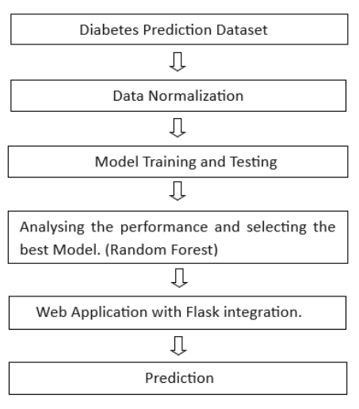

# 🩺 Diabetes Mellitus Prediction System

Predictive Analysis of Diabetes Mellitus using Data Mining Algorithms

---

## 📌 Overview

Diabetes Mellitus (DM) is a chronic disease affecting millions globally.  
This project presents a web-based system that predicts the likelihood of diabetes using classic data mining classification techniques.

The system is designed to deliver:
- Accurate predictions
- Interpretable results
- Real-time user interaction via a Flask web application

---

## 🚀 Features

- Reliable prediction system with **96.97% accuracy**
- Real-time prediction using trained ML model
- Simple and intuitive user interface
- Risk classification (Low / Medium / High)
- Easily extendable for future improvements

---

## 🧠 Algorithms Used

- Decision Tree  
- Naïve Bayes  
- Random Forest (**Best Performer**)

---

## 🏗️ System Architecture


---

## 🔄 Workflow / ML Pipeline



---

## 📊 Dataset

The dataset includes medical attributes such as:

- Age  
- Body Mass Index (BMI)  
- HbA1c level  
- Blood glucose level  
- Hypertension  
- Heart disease  

**Target Variable:**
- 1 → Diabetic  
- 0 → Non-diabetic  

---

## ⚙️ Methodology

1. **Data Preprocessing**
   - Handle missing values  
   - Normalize features  
   - Encode categorical data  

2. **Model Training**
   - Train Decision Tree, Naïve Bayes, Random Forest  
   - 70:30 train-test split  

3. **Model Evaluation**
   - Accuracy  
   - Precision  
   - Recall  
   - F1-score  

4. **Model Selection**
   - Random Forest selected as best model  

5. **Web Deployment**
   - Flask-based web application  

---

## 📈 Results

| Model           | Accuracy | Performance |
|----------------|---------|------------|
| Decision Tree  | 93.78%  | Good       |
| Naïve Bayes    | 91.89%  | Moderate   |
| Random Forest  | **96.97%** | Excellent |

---

## 📸 Screenshots

### Home Page


### Prediction Result


---

## ⚙️ Installation & Setup

### 1. Clone the repository
```bash
git clone https://github.com/your-username/Diabetes-Mellitus-Prediction.git
cd Diabetes-Mellitus-Prediction
```
### 2. Install Dependencies
```bash
pip install -r requirements.txt
```
### 3. Train the model
```bash
python backend/utils/train_model.py
```
### 4. Run the application
```bash
python backend/app.py
```
### 5. Open in browser
```bash
http://127.0.0.1:5000/
```
